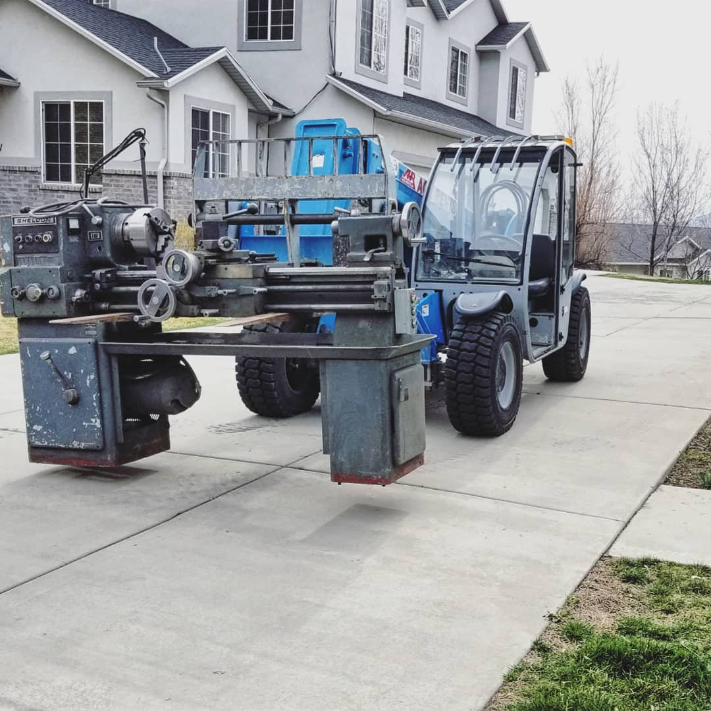
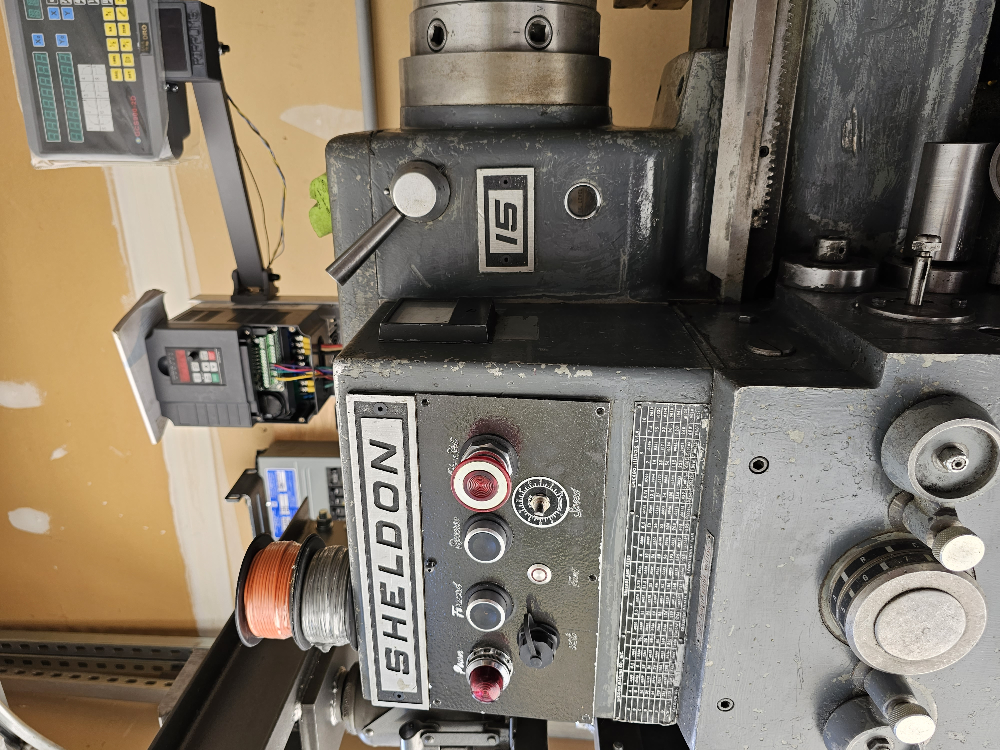
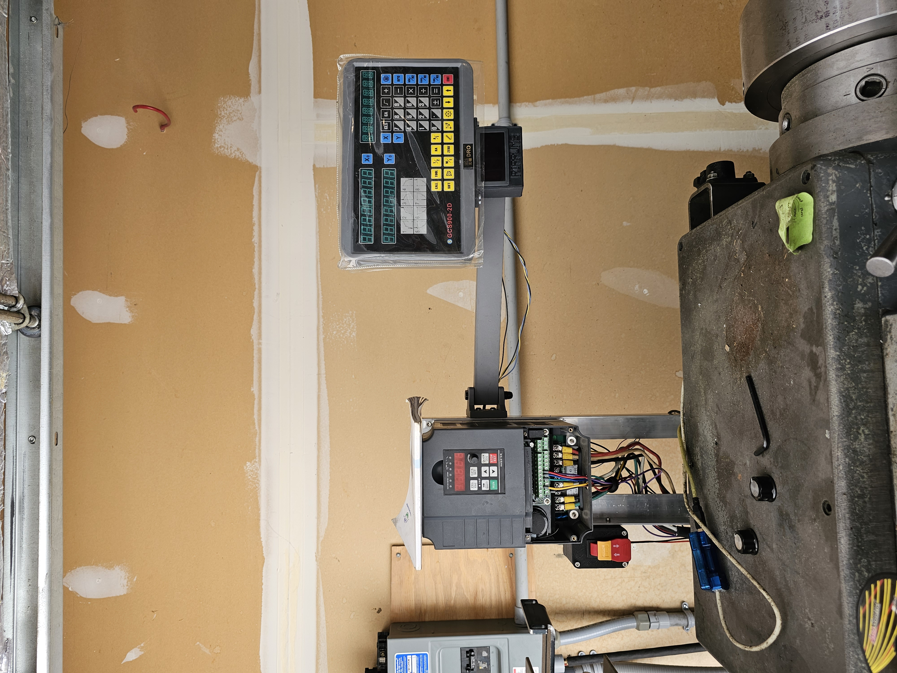
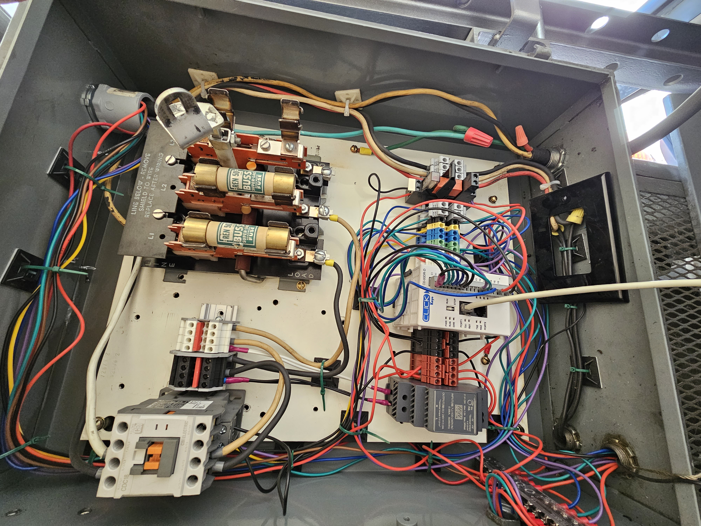

# Engine Lathe VFD Control System

*Figure 1: I can fix her
## Overview
This project contains the embedded control logic for a hardware retrofit of a 1960s-era Engine Lathe. 

### The Salvage Story
This project began with a high-stakes rescue. I received a call that a local manufacturing plant was scheduled to scrap this machine the following day. Within 24 hours, I had to arrange for a forklift, rig the machine, and transport it to my shop to prevent it from being destroyed.

### Mechanical Restoration & Engineering Challenges
The machine required extensive mechanical overhaul before the electronics could be integrated:
-   **Apron Rebuild**: Disassembled and rebuilt the internal worm gear mechanism to restore drive functionality.
-   **Precision Straightening**: The cross-feed shaft was significantly bent; I utilized flame-straightening techniques to restore it to functional tolerance.
-   **The Limit of Restoration**: Despite the success of the mechanical and electronic retrofits, the lathe's ways were found to be warped. The cost of shipping and professional regrinding exceeded the machine's value. When offered a fully operational lathe later that year, I made the strategic decision to sell this project to a collector and transition to a working machine.

> **Note:** This codebase represents the functional prototype...

## System Architecture
### Hardware
-   **Main Platform**: Arduino Mega 2560 (Selected for high interrupt pin count).
-   **Drive System**: 2.2kW Variable Frequency Drive (VFD) converting single-phase 220V to 3-phase power.
-   **Inputs**:
    -   Front Control Panel (Headstock Station).
    -   Carriage/Rear Control Panel (Tailstock Station).
    -   VFD Fault Relay (Monitoring VFD parameter P6.02=4).
-   **Outputs**:
    -   Electromechanical Relays (Switching 24V VFD logic inputs).
    -   Fault Clear Signal (Relay-driven reset command to VFD).
- **DRO**

## Key Features
-   **State Machine Control**: Robust handling of Idle, Forward, Reverse, and Fault states.
-   **Dual-Station Support**: Full control of spindle direction from both the headstock and the carriage station.
-   **Interrupt-Driven Stop**: Any button press while running acts as an immediate STOP command via hardware interrupts.
-   **Fail-Safe Fault Logic**: Power-on state defaults to FAULT, requiring a manual reset before the spindle can be engaged.
-   **VFD Integration**: Bi-directional communication with the VFD for fault monitoring and remote resetting.

## Media

*Figure 3: Custom operator control panel.*

*Figure 4: Integrated digital tachometer and DRO.*

*Figure 5: Eventual PLC
## Logic Flow
1.  **Fault Check**: On boot, system enters FAULT state. Requires physical reset.
2.  **Idle**: System awaits Forward or Reverse command from either station.
3.  **Motion**:
    -   Activates corresponding VFD relay.
    -   Monitors for *any* button press to trigger an immediate STOP (Idle) state.
    -   Monitors VFD fault relay for hardware-level errors.

---
*Project Status: Archived / Prototype*